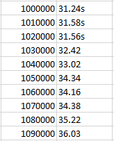
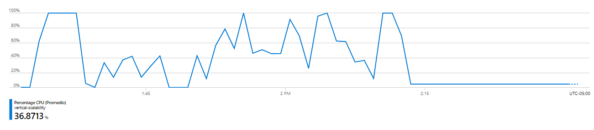
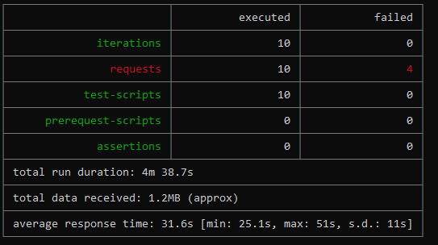

### Escuela Colombiana de Ingeniería
### Arquitecturas de Software - ARSW

## Escalamiento en Azure con Maquinas Virtuales, Sacale Sets y Service Plans

### Dependencias
* Cree una cuenta gratuita dentro de Azure. Para hacerlo puede guiarse de esta [documentación](https://azure.microsoft.com/en-us/free/search/?&ef_id=Cj0KCQiA2ITuBRDkARIsAMK9Q7MuvuTqIfK15LWfaM7bLL_QsBbC5XhJJezUbcfx-qAnfPjH568chTMaAkAsEALw_wcB:G:s&OCID=AID2000068_SEM_alOkB9ZE&MarinID=alOkB9ZE_368060503322_%2Bazure_b_c__79187603991_kwd-23159435208&lnkd=Google_Azure_Brand&dclid=CjgKEAiA2ITuBRDchty8lqPlzS4SJAC3x4k1mAxU7XNhWdOSESfffUnMNjLWcAIuikQnj3C4U8xRG_D_BwE). Al hacerlo usted contará con $200 USD para gastar durante 1 mes.

### Parte 0 - Entendiendo el escenario de calidad

Adjunto a este laboratorio usted podrá encontrar una aplicación totalmente desarrollada que tiene como objetivo calcular el enésimo valor de la secuencia de Fibonnaci.

**Escalabilidad**
Cuando un conjunto de usuarios consulta un enésimo número (superior a 1000000) de la secuencia de Fibonacci de forma concurrente y el sistema se encuentra bajo condiciones normales de operación, todas las peticiones deben ser respondidas y el consumo de CPU del sistema no puede superar el 70%.

### Parte 1 - Escalabilidad vertical

1. Diríjase a el [Portal de Azure](https://portal.azure.com/) y a continuación cree una maquina virtual con las características básicas descritas en la imágen 1 y que corresponden a las siguientes:
    * Resource Group = SCALABILITY_LAB
    * Virtual machine name = VERTICAL-SCALABILITY
    * Image = Ubuntu Server 
    * Size = Standard B1ls
    * Username = scalability_lab
    * SSH publi key = Su llave ssh publica


2. Para conectarse a la VM use el siguiente comando, donde las `x` las debe remplazar por la IP de su propia VM.

    `ssh scalability_lab@xxx.xxx.xxx.xxx`

3. Instale node, para ello siga la sección *Installing Node.js and npm using NVM* que encontrará en este [enlace](https://linuxize.com/post/how-to-install-node-js-on-ubuntu-18.04/).
4. Para instalar la aplicación adjunta al Laboratorio, suba la carpeta `FibonacciApp` a un repositorio al cual tenga acceso y ejecute estos comandos dentro de la VM:

    `git clone <your_repo>`

    `cd <your_repo>/FibonacciApp`

    `npm install`

5. Para ejecutar la aplicación puede usar el comando `npm FibinacciApp.js`, sin embargo una vez pierda la conexión ssh la aplicación dejará de funcionar. Para evitar ese compartamiento usaremos *forever*. Ejecute los siguientes comando dentro de la VM.

    `npm install forever -g`

    `forever start FibinacciApp.js`

6. Antes de verificar si el endpoint funciona, en Azure vaya a la sección de *Networking* y cree una *Inbound port rule* tal como se muestra en la imágen. Para verificar que la aplicación funciona, use un browser y user el endpoint `http://xxx.xxx.xxx.xxx:3000/fibonacci/6`. La respuesta debe ser `The answer is 8`.


7. La función que calcula en enésimo número de la secuencia de Fibonacci está muy mal construido y consume bastante CPU para obtener la respuesta. Usando la consola del Browser documente los tiempos de respuesta para dicho endpoint usando los siguintes valores:
    * 1000000
    * 1010000
    * 1020000
    * 1030000
    * 1040000
    * 1050000
    * 1060000
    * 1070000
    * 1080000
    * 1090000    

8. Dírijase ahora a Azure y verifique el consumo de CPU para la VM. (Los resultados pueden tardar 5 minutos en aparecer).


9. Ahora usaremos Postman para simular una carga concurrente a nuestro sistema. Siga estos pasos.
    * Instale newman con el comando `npm install newman -g`. Para conocer más de Newman consulte el siguiente [enlace](https://learning.getpostman.com/docs/postman/collection-runs/command-line-integration-with-newman/).
    * Diríjase hasta la ruta `FibonacciApp/postman` en una maquina diferente a la VM.
    * Para el archivo `[ARSW_LOAD-BALANCING_AZURE].postman_environment.json` cambie el valor del parámetro `VM1` para que coincida con la IP de su VM.
    * Ejecute el siguiente comando.

    ```
    newman run ARSW_LOAD-BALANCING_AZURE.postman_collection.json -e [ARSW_LOAD-BALANCING_AZURE].postman_environment.json -n 10 &
    newman run ARSW_LOAD-BALANCING_AZURE.postman_collection.json -e [ARSW_LOAD-BALANCING_AZURE].postman_environment.json -n 10
    ```

10. La cantidad de CPU consumida es bastante grande y un conjunto considerable de peticiones concurrentes pueden hacer fallar nuestro servicio. Para solucionarlo usaremos una estrategia de Escalamiento Vertical. En Azure diríjase a la sección *size* y a continuación seleccione el tamaño `B2ms`.


11. Una vez el cambio se vea reflejado, repita el paso 7, 8 y 9.
12. Evalue el escenario de calidad asociado al requerimiento no funcional de escalabilidad y concluya si usando este modelo de escalabilidad logramos cumplirlo.
13. Vuelva a dejar la VM en el tamaño inicial para evitar cobros adicionales.

**Preguntas**

1. ¿Cuántos y cuáles recursos crea Azure junto con la VM?                                                 
   * Redes (NIC, Public IP Address y Virtual Network)
   * Discos (Tamaño)
   * Seguridad (Network Security Group)
   * Recursos de acceso (Llave SSH)
   * Backup (Copia de seguridad)

Network Interface                                             

2. ¿Brevemente describa para qué sirve cada recurso?
* Redes:
   * NIC: Componente que proporciona capacidades de red para una computadora.   
   * Virtual Network: Sirve para realizar comunicación entre recursos de azure como Azure Virtual Machines, es como una red simple, sin embargo ofrece beneficios adicionales       como escalabilidad, aislamiento y disponibilidad.
   * Public IP Address: Es una dirección IP que se utiliza para acceder a Internet. Las direcciones IP públicas (globales) se enrutan en Internet, a diferencia de las              direcciones privadas.

* Discos: Es la interfaz que se encarga de cuadrar el almacenamiento de la máquina virtual Azure.

* Seguridad:
   * Network Security Group: Sistema que realiza la función de in firewall para redes On Cloud, filtra el tráfico de salida y entrada de los recursos de una red virtual de      Azure, lo hace por medio de grupos de seguridad que definen estas reglas.

* Recursos de acceso:
   * Llave SSH: Llaves usadas para el acceso a la máquina virtual por medio de un sistema de cifrado asimétrico.

* Backup:
   * Copia de seguridad: Copia de la maquina usada para la protección de cargas de trabajo empresariales y restauracion frente a fallos.

3. ¿Al cerrar la conexión ssh con la VM, por qué se cae la aplicación que ejecutamos con el comando `npm FibonacciApp.js`? ¿Por qué debemos crear un *Inbound port rule* antes de acceder al servicio?
Ya que la ejecucion va ligada a la conexion que se establece con nuestra maquina, luego se cae porque el proceso no se está ejecutando en segundo plano, es decir, no se está ejecutando como un Daemon (o programa persistente) al momento de cerrar la conexión ssh.

Debemos crear la inbound port rule ya nodejs se ejecuta por defecto en el puerto 3000 necesitamos crear la regla para obtener el acceso público al servicio. Ademas en azure, para abrir un puerto o crear un punto de conexión, es necesario crear filtros de red o reglas del firewall del sistema operativo en la maquina virtual. Estas reglas controlan el tráfico entrante y saliente, se colocan en un grupo de seguridad de red asociado al recurso que va a recibir dicho tráfico. En esta caso, se hace necesario crear una regla para crear un punto de conexión con el protocolo ssh.

4. Adjunte tabla de tiempos e interprete por qué la función tarda tando tiempo.                           


La función tarda tanto tiempo porque se hace uso de una memoria con muy poca capacidad (B1ls estándar (1 vcpu, 0.5 GiB de memoria))

5. Adjunte imágen del consumo de CPU de la VM e interprete por qué la función consume esa cantidad de CPU.


6. Adjunte la imagen del resumen de la ejecución de Postman. Interprete:
    * Tiempos de ejecución de cada petición.
    
    
    
    * Si hubo fallos documentelos y explique.
    
    Hubo 4 fallos que se dieron principalmente ya que se realizó escalamiento vertical y la capacidad de procesamiento no es la suficiente para procesar las pruebas, si se realiza mas eficiente pero no lo suficiente para el procesamiento necesario.
    
7. ¿Cuál es la diferencia entre los tamaños `B2ms` y `B1ls` (no solo busque especificaciones de infraestructura)?
* B2ms:
   * vCpu: 2
   * Memory GiB: 8
   * SSD Temp storage: 16
   * Base CPU Performance: 60%
   * Max CPU Performance: 200%
   * Max data discs: 4
   * Max NIC:3
* B1ls:
   * vCpu: 1
   * Memory GiB: 0.5
   * SSD Temp storage: 4
   * Base CPU Performance: 5%
   * Max CPU Performance: 100%
   * Max data discs: 2
   * Max NIC: 2


La máquina B2ms es mas cara y tiene mas capacidad que la máquina B1ls, B2ms esta disponible para Windows y linux.

8. ¿Aumentar el tamaño de la VM es una buena solución en este escenario?, ¿Qué pasa con la FibonacciApp cuando cambiamos el tamaño de la VM?

Creemos que no es lo mejor ya que no se usaron mecanismos que nos grantizaran concurrencia por ende mejoraremos muy poco pero se seguiran teniendo los mismos problemas.

Cuando cambiamos el tamaño de la máquina virtual es necesario reiniciarla, por lo tanto se pierde disponibilidad de la aplicación ya que esta deja de funcionar mientras se reinicia.

9. ¿Qué pasa con la infraestructura cuando cambia el tamaño de la VM? ¿Qué efectos negativos implica?

Esto cambia los recursos de la maquina asi que es muy probable que afecte la disponibilidad al perderse los archivos de la maquina.

10. ¿Hubo mejora en el consumo de CPU o en los tiempos de respuesta? Si/No ¿Por qué?

En nuestro caso si se redujo el consumo de CPU por el aumento en la capacidad de procesador disminuyo de 36.8% a 2.6%.

11. Aumente la cantidad de ejecuciones paralelas del comando de postman a `4`. ¿El comportamiento del sistema es porcentualmente mejor?

En nuestro caso si fue mejor y tiene sentido ya que ahora son el doble de sesiones.

### Parte 2 - Escalabilidad horizontal

#### Crear el Balanceador de Carga

Antes de continuar puede eliminar el grupo de recursos anterior para evitar gastos adicionales y realizar la actividad en un grupo de recursos totalmente limpio.

1. El Balanceador de Carga es un recurso fundamental para habilitar la escalabilidad horizontal de nuestro sistema, por eso en este paso cree un balanceador de carga dentro de Azure tal cual como se muestra en la imágen adjunta.


2. A continuación cree un *Backend Pool*, guiese con la siguiente imágen.


3. A continuación cree un *Health Probe*, guiese con la siguiente imágen.


4. A continuación cree un *Load Balancing Rule*, guiese con la siguiente imágen.


5. Cree una *Virtual Network* dentro del grupo de recursos, guiese con la siguiente imágen.


#### Crear las maquinas virtuales (Nodos)

Ahora vamos a crear 3 VMs (VM1, VM2 y VM3) con direcciones IP públicas standar en 3 diferentes zonas de disponibilidad. Después las agregaremos al balanceador de carga.

1. En la configuración básica de la VM guíese por la siguiente imágen. Es importante que se fije en la "Avaiability Zone", donde la VM1 será 1, la VM2 será 2 y la VM3 será 3.


2. En la configuración de networking, verifique que se ha seleccionado la *Virtual Network*  y la *Subnet* creadas anteriormente. Adicionalmente asigne una IP pública y no olvide habilitar la redundancia de zona.


3. Para el Network Security Group seleccione "avanzado" y realice la siguiente configuración. No olvide crear un *Inbound Rule*, en el cual habilite el tráfico por el puerto 3000. Cuando cree la VM2 y la VM3, no necesita volver a crear el *Network Security Group*, sino que puede seleccionar el anteriormente creado.


4. Ahora asignaremos esta VM a nuestro balanceador de carga, para ello siga la configuración de la siguiente imágen.


5. Finalmente debemos instalar la aplicación de Fibonacci en la VM. para ello puede ejecutar el conjunto de los siguientes comandos, cambiando el nombre de la VM por el correcto

```
git clone https://github.com/daprieto1/ARSW_LOAD-BALANCING_AZURE.git

curl -o- https://raw.githubusercontent.com/creationix/nvm/v0.34.0/install.sh | bash
source /home/vm1/.bashrc
nvm install node

cd ARSW_LOAD-BALANCING_AZURE/FibonacciApp
npm install

npm install forever -g
forever start FibonacciApp.js
```

Realice este proceso para las 3 VMs, por ahora lo haremos a mano una por una, sin embargo es importante que usted sepa que existen herramientas para aumatizar este proceso, entre ellas encontramos Azure Resource Manager, OsDisk Images, Terraform con Vagrant y Paker, Puppet, Ansible entre otras.

#### Probar el resultado final de nuestra infraestructura

1. Porsupuesto el endpoint de acceso a nuestro sistema será la IP pública del balanceador de carga, primero verifiquemos que los servicios básicos están funcionando, consuma los siguientes recursos:

```
http://52.155.223.248/
http://52.155.223.248/fibonacci/1
```

2. Realice las pruebas de carga con `newman` que se realizaron en la parte 1 y haga un informe comparativo donde contraste: tiempos de respuesta, cantidad de peticiones respondidas con éxito, costos de las 2 infraestrucruras, es decir, la que desarrollamos con balanceo de carga horizontal y la que se hizo con una maquina virtual escalada.  

3. Agregue una 4 maquina virtual y realice las pruebas de newman, pero esta vez no lance 2 peticiones en paralelo, sino que incrementelo a 4. Haga un informe donde presente el comportamiento de la CPU de las 4 VM y explique porque la tasa de éxito de las peticiones aumento con este estilo de escalabilidad.

```
newman run ARSW_LOAD-BALANCING_AZURE.postman_collection.json -e [ARSW_LOAD-BALANCING_AZURE].postman_environment.json -n 10 &
newman run ARSW_LOAD-BALANCING_AZURE.postman_collection.json -e [ARSW_LOAD-BALANCING_AZURE].postman_environment.json -n 10 &
newman run ARSW_LOAD-BALANCING_AZURE.postman_collection.json -e [ARSW_LOAD-BALANCING_AZURE].postman_environment.json -n 10 &
newman run ARSW_LOAD-BALANCING_AZURE.postman_collection.json -e [ARSW_LOAD-BALANCING_AZURE].postman_environment.json -n 10
```

|         Máquina       |CPU (promedio en la ultima hora)                       |
|----------------|-------------------------------|-----------------------------|
|Máquina 1| 13,3631%       
|Máquina 2          |13,653%          
|Máquina 3          |23,2629%
|Máquina 4          |27,664%    

La tasa de éxito aumento al utilizar escalamiento horizontal, porque la carga se distribuye de una mejor manera, al usar diferentes dispositivos que la atiendan, que al utilizar uno solo.

**Preguntas**

* ¿Cuáles son los tipos de balanceadores de carga en Azure y en qué se diferencian?, ¿Qué es SKU, qué tipos hay y en qué se diferencian?, ¿Por qué el balanceador de carga necesita una IP pública?
* Tipos de balanceadores:
   * Public Load Balancer: Se utiliza cuando se necesite proporcionar conexiones salientes para máquinas virtuales (VM) dentro de su red virtual. Estas conexiones se logran traduciendo sus direcciones IP privadas a direcciones IP públicas. Los balanceadores de carga públicos se utilizan para equilibrar la carga del tráfico de Internet hacia sus máquinas virtuales.

   * Private Load Balancer: Se utiliza cuando se necesitan direcciones IP privadas solo en la interfaz. Los equilibradores de carga internos se utilizan para equilibrar la carga del tráfico dentro de una red virtual. Se puede acceder a una interfaz de balanceador de carga desde una red local en un escenario híbrido.

   * ¿Cuál es el propósito del *Backend Pool*?
      * Es un componente crítico del balanceador de carga que permite definir el grupo de recursos que brindarán tráfico para una regla de equilibrio de carga determinada.

   * Hay dos formas de configurar un grupo de backend:
      * Tarjeta de interfaz de red (NIC)
      * Combinación de dirección IP e ID de recurso de red virtual (VNET)

   * ¿Cuál es el propósito del *Health Probe*?
      * Health probe marca cuando una instancia responde con un estado HTTP 200 dentro del período de tiempo de espera. Luego nos permite verificars si las instancias estan en un estado correcto, esto se realiza con una sonda de estado intenta comprobar el puerto de la sonda de estado configurado cada 15 segundos de forma predeterminada. El punto final de la sonda devuelve un código de respuesta HTTP distinto de 200 (por ejemplo, 403, 404 o 500)

* ¿Cuál es el propósito de la *Load Balancing Rule*? ¿Qué tipos de sesión persistente existen, por qué esto es importante y cómo puede afectar la escalabilidad del sistema?.
   * Se usa para definir cómo se distribuye el tráfico a las VM. Primero se define la configuración de IP del frontend para el tráfico entrante y el grupo de IP para el backend.
   * Tipos de Sesión de Persistencia
      * Distribución basada en hash:
   Es la distribucion que se encarga de asignar el tráfico al pool, esta distribucion mejora el rendimiento de las consultas en tabla grandes distribuidas en forma de estrella. Pueden tener un gran número de filas y aun así lograr un alto rendimiento.

      * Modo de afinidad de IP de origen
    Este modo utiliza un hash de dos tuplas (IP de origen e IP de destino) o de tres tuplas (IP de origen, IP de destino y tipo de protocolo) para asignar el tráfico a los servidores disponibles.
   * Un ejemplo de su funcionamiento seria:
      * Un cliente inicia una sesión TCP en la dirección pública con equilibrio de carga y se dirige a un DIP específico. El canal se deja activo para monitorear el estado de la conexión.
      * Se inicia una nueva sesión UDP desde el mismo equipo cliente en el mismo punto final público con equilibrio de carga. La conexión se dirige al mismo punto final DIP que la conexión TCP anterior. La carga de medios se puede ejecutar con un alto rendimiento mientras se mantiene un canal de control a través de TCP.


* ¿Qué es una *Virtual Network*? ¿Qué es una *Subnet*? ¿Para qué sirven los *address space* y *address range*?
   * Virtual Network:
   Una red virtual es una red donde todos los dispositivos, servidores, máquinas virtuales y centros de datos que están conectados lo hacen a través de software y tecnología inalámbrica. Esto permite expandir el alcance de la red tanto como sea necesario para lograr la máxima eficiencia, además de muchos otros beneficios.
   * Subnet:
   Una subred, o subred, es una red dentro de una red. Las subredes hacen que las redes sean más eficientes. A través de la división en subredes, el tráfico de la red puede viajar una distancia más corta sin pasar por enrutadores innecesarios para llegar a su destino.
   * Address space:
   Un espacio de direcciones define un rango de direcciones discretas, cada una de las cuales puede corresponder a un host de red, dispositivo periférico, sector de disco, una celda de memoria u otra entidad lógica o física.
   * Address range:
   Es el numero de direcciones que se puedan asignar en el Address space.
   
* ¿Qué son las *Availability Zone* y por qué seleccionamos 3 diferentes zonas?. ¿Qué significa que una IP sea *zone-redundant*?
   * Availability zone:
   Las zonas de disponibilidad son ubicaciones físicas únicas con alimentación, red y refrigeración independientes. Cada zona de disponibilidad se compone de uno o más centros de datos y alberga infraestructura para admitir aplicaciones de misión crítica de alta disponibilidad.
   * Zone-redundant:
     Una ip zone-redundant permite implementar automáticamente puertas de enlace de red virtual en las zonas de disponibilidad, Con las puertas de enlace con redundancia de zona, puede beneficiarse de la resistencia de zona para acceder a sus servicios escalables y de misión crítica en Azure.
* ¿Cuál es el propósito del *Network Security Group*?
   * Permitir que se filtre el tráfico de red hacia y desde los recursos de Azure en una red virtual de Azure. Permite establecer reglas de seguridad que permiten o deniegan el tráfico de red entrante o el tráfico de red saliente definiendo origen y destino, puerto y protocolo.


* Informe de newman 1 (Punto 2)

|                |Escalamiento vertical                          |Escalamiento horizontal                        |
|----------------|-------------------------------|-----------------------------|
|Tiempos de respuesta| 31.6s        |29.2s          |
|Cantidad de peticiones respondidas con éxito          |6            |10            |
|Costos de las 2 infraestrucruras          |Costoso|Economico|


* Presente el Diagrama de Despliegue de la solución.


